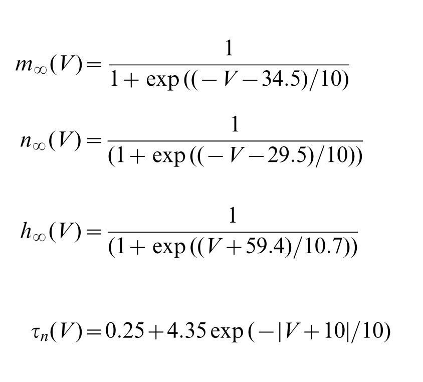
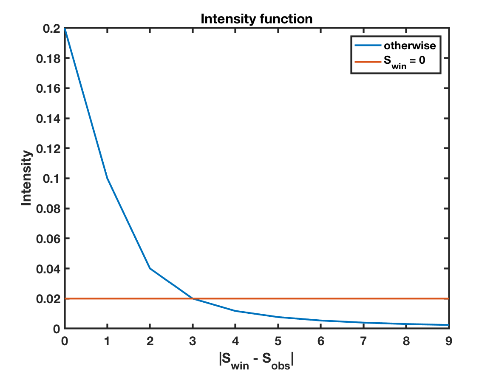
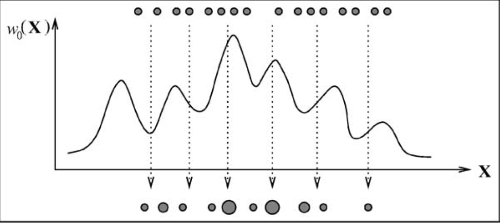

@title[Introduction]
## Parameter Estimation
##### Inferring potassium concentration gradients from observed spike times using a particle filter to estimate parameters of a Hodgkin-Huxley-type model

---
## Background


+++
### Overview

- Given an observed spike pattern what, if anything, can be said about the underlying mechanisms? 

@ul
- **Approach:** combine a conductance based biophysical model of neuron voltage activity (HH-type model) with point process statistical theory (particle filter) 
- **Data:** living neurons recorded *in vitro* from rat L5 intrinsically bursting (IB) neurons 

@ulend

Note:
IB cells possess an intrinsic muscarinic-receptor suppressed M-current, which is the primary driver of rhythmic activity in the data.

+++
### Results

> Through this technique, we show that the same intrinsic current – a slow, depolarization activated, hyperpolarizing current, consistent with a known intrinsic current of the IB cells – supports the two distinct dynamic regimes of activity.

<span style="font-size: 0.6em">Meng et al., 2014</span>

+++
### Visualization and descriptive statistics


Note:
Visualizations and descriptive statistics of the observed spike times suggest two modes of behavior in the same cell class. 1A–4A: 1 second interval of spike train data for each of the four cells considered. 1B–4B: The histogram of inter-spike intervals for cells 1–4. 1C–4C: The spectrum of cells 1–4 (solid blue line) and its 95% confidence intervals (dashed red lines). The dashed black line indicates the estimate of overall spiking rate N(T) T where N(T) represents the total number of spikes up to time T.

+++
### Biophysical modeling

 
<span style="font-size: 0.6em">
 $g_B$: conductance, $\tau_B$: time constant (slow), $E_B$: reversal potential (hyperpolarizing), <br>
 $S_B$, $V_Bth$: gating parameters (depolarization activated)
</span> 

Note:
Figure 3. Locations of converged particles for the mystery current model. A–C: The blue, black, red, and green dots indicate converged particles for cells 1–4 respectively. B: The horizontal dashed line indicates tB~12 and the vertical dashed line indicates the resting potential265 mV. C: The horizontal dashed line indicates SB~0 and the vertical dashed line indicates resting potential 265 mV. The three coordinate spaces for each data set span the initial parameter value space in the estimation procedure.

+++
### Discussion
TBD

---
## Goal
Study changes in potassium ion concentration gradients during seizure onset

---
## Approach

@ol
- Infer single unit spike times from micro array recordings (spike sorting using KiloSort and MountainSort)
- Assume Hodgkin-Huxley-type dynamics approximate cell spiking activity reasonably well
- Estimate model parameters using a particle filter
@olend

---
## Hodgkin-Huxley (HH) Model


+++
### Model equations




---
## Particle Filter 
## (Sequential Monte Carlo)

+++
### Overview

<span style="padding: 15px">
`
$$
\mathbb P(\mathbf{S}_{1:K}, \mathbf{\Theta} | \Delta N_k) = 
\frac{\mathbb P(\Delta N_k | \mathbf{S}_{1:K}, \mathbf{\Theta}) \mathbb P(\mathbf{S}_{1:K}, \mathbf{\Theta})}{\mathbb P(\Delta N_k)}
$$
`
</span>


+++
### Overview


+++
### Particle filter considerations

@ul
- Intensity function (how particles are assigned weights)
- Resampling scheme (how we avoid degeneracy)
@ulend

+++
#### Intensity function

<span style="padding: 15px">
`$$\lambda_k = \left\{\begin{array}{cl}
b, & if \ S_{win} = 0 \\
\frac{h}{1 + |\Delta N_{win} - \Delta N_{obs}|^2}, & otherwise
\end{array}\right.$$`
</span>

<span style="font-size: 0.6em">
`
$$ 
\Delta N_{win} = \mbox{spikes in window}, \quad \Delta N_{obs} =\mbox{observed spikes}, 
$$
$$$$
$$
W = \mbox{5 ms}, \quad h = \frac{1}{5ms}, \quad b = \frac{h}{10}
$$
`
</span>

+++
### Intensity function


+++
### Resampling scheme
Multinomial resampling 


```matlab
inds = floor(interp1(cumsum(weights), 1:N, r, 'linear', 0)) + 1;
```

+++
### Annealed Particle Filter


<figcaption style="font: caption">
Deutscher, J. and Reid, I. (2005) ‘Articulated body motion capture by stochastic search’, International Journal of Computer Vision, 61(2), pp. 185–205. doi: 10.1023/B:VISI.0000043757.18370.9c.
</figcaption>

+++
@title[Annealed Particle Filter]

<br>
<span style="font-size: 12pt">
Deutscher, J. and Reid, I. (2005).
</span>

---
## Progress

---
## Considerations


